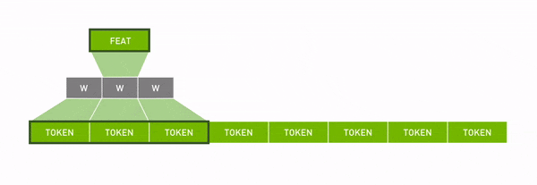

# DNN animations

Animations for explaining DNN layers

## Animations

### Convolution

## RNN

### Self Attention

## Contributing

Any relevant contributions are welcome! Feel free to open a pull request. 

**Simple Requirements**

Follow the style of the current animations. Please use the font DIN Pro for text.

**Core Maintainer**

Timothy Liu / [@tlkh](https://github.com/tlkh)
